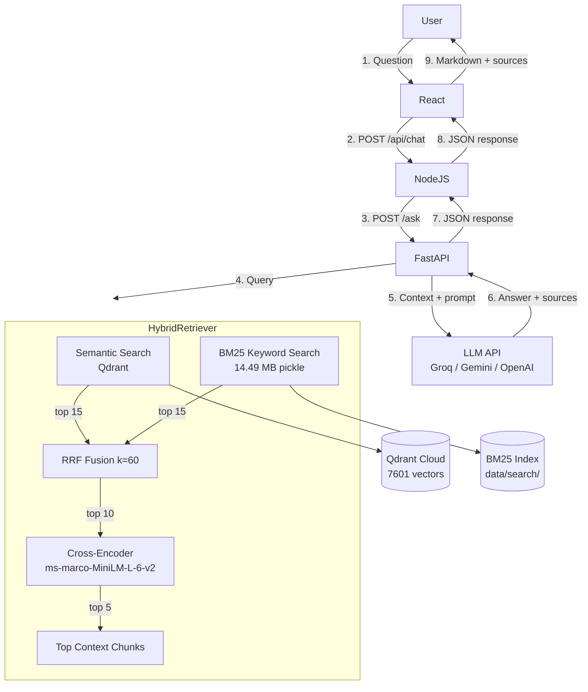
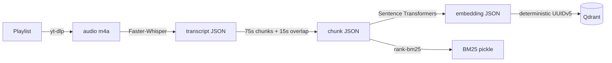
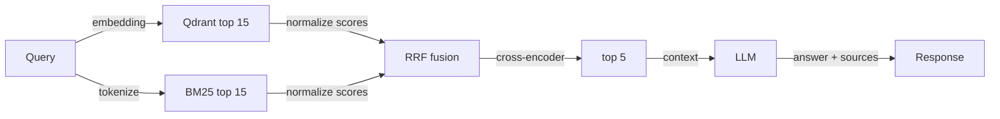

# Striver DSA AI Mentor

> A full-stack RAG (Retrieval-Augmented Generation) system that transforms 316 Striver A2Z DSA YouTube lectures into an interactive AI mentor with hybrid search, cross-encoder reranking, and grounded LLM answers.

## Problem Statement

Learning Data Structures & Algorithms (DSA) from video lectures is passive. Students cannot easily:
- Search across 316 lectures for specific concepts
- Get timestamp-precise citations from lecture transcripts
- Receive contextual hints without immediately revealing the full solution
- Verify their code against lecture-taught patterns

This project solves those problems by indexing timestamp-aware transcript chunks with hybrid semantic + keyword retrieval, reranking results for relevance, and generating grounded answers with YouTube timestamp citations.

## Key Features

- **316-video knowledge base** ingested from the Striver A2Z DSA YouTube playlist
- **Hybrid retrieval**: semantic search (Qdrant) + BM25 keyword search combined with Reciprocal Rank Fusion (RRF)
- **Cross-encoder reranking** for precision result ordering
- **Grounded LLM answers** that cite YouTube timestamps from the actual lecture content
- **5 mentor modes**: Explain, Hint, Approach, Code Review, Quiz
- **Multi-turn conversation state** for progressive hints, quiz tracking, and code review context
- **Full-stack UI**: React chat interface with Markdown rendering and source cards
- **Production-ready**: FastAPI lifespan startup, health checks, request validation, CORS, and error handling

## Architecture



## RAG Pipeline

### Ingestion



316 videos are processed sequentially. Each stage validates its output before marking completion, so interrupted ingestion resumes from the first incomplete video.

### Query



## Mentor Modes

| Mode | System Prompt Behavior |
|---|---|
| **Explain** | Concept, example, complexity, edge cases |
| **Hint** | Progressive hints without full solution |
| **Approach** | Problem-solving framework without full code |
| **Code Review** | Correctness, complexity, bugs, edge cases |
| **Quiz** | One-question-at-a-time interactive quiz |

## Dataset

| Metric | Value |
|---|---|
| Videos ingested | 316 |
| Qdrant vectors | 7601 |
| Transcript chunks | timestamp-aware, 75s with 15s overlap |
| Embedding model | `sentence-transformers/all-MiniLM-L6-v2` (384-dim) |
| Reranker model | `cross-encoder/ms-marco-MiniLM-L-6-v2` |
| BM25 index | 14.49 MB, persisted pickle |
| Storage | Qdrant Cloud (managed) |

## Setup

### Prerequisites

- Python 3.11+
- Node.js 20+
- npm 10+
- Qdrant Cloud account
- Groq / Gemini / OpenAI API key

### Installation

```bash
git clone <repo-url>
cd "Ai revision dsa"
pip install -r requirements.txt
cd server && npm install && cd ..
cd client && npm install && cd ..
```

### Environment Variables

```bash
cp .env.example .env
# Edit .env with your QDRANT_URL, QDRANT_API_KEY, GROQ_API_KEY, etc.
```

### Running Locally

```bash
# Terminal 1 - Python RAG API
uvicorn server.python_api:app --host 127.0.0.1 --port 8000

# Terminal 2 - Node backend
cd server && npm start

# Terminal 3 - React frontend
cd client && npm run dev
```

Open `http://localhost:5173`

## API Endpoints

### Python FastAPI (`http://127.0.0.1:8000`)

| Method | Endpoint | Description |
|---|---|---|
| `GET` | `/health` | Health check |
| `POST` | `/ask` | Ask a DSA question |

**POST /ask**

Request body:
```json
{
  "query": "Explain binary search",
  "mode": "explain",
  "top_k": 5,
  "min_score": 0.25,
  "conversation_id": "optional-session-id",
  "history": [
    {"role": "user", "content": "Previous question"},
    {"role": "assistant", "content": "Previous answer"}
  ]
}
```

Response body:
```json
{
  "answer": "Lower bound is the first index...",
  "grounded": true,
  "sources": [
    {
      "title": "BS-2. Implement Lower Bound and Upper Bound",
      "video_id": "6zhGS79oQ4k",
      "start_sec": 205,
      "timestamp": "03:25",
      "url": "https://www.youtube.com/watch?v=6zhGS79oQ4k&t=205s"
    }
  ],
  "conversation_id": "abc123"
}
```

### Node.js/Express (`http://localhost:5000`)

| Method | Endpoint | Description |
|---|---|---|
| `GET` | `/api/health` | Health check (probes Python) |
| `POST` | `/api/chat` | Proxy to Python RAG |
| `POST` | `/api/conversations` | Create conversation |
| `GET` | `/api/conversations/:id` | Get conversation state |
| `DELETE` | `/api/conversations/:id` | Delete conversation |

**POST /api/chat**

Request body:
```json
{
  "message": "Explain binary search",
  "mode": "explain",
  "conversationId": "optional-session-id"
}
```

Response body: same structure as Python `/ask`.

## Environment Variables

### Root `.env` (Python service)

| Variable | Required | Default | Description |
|---|---|---|---|
| `QDRANT_URL` | Yes | — | Qdrant Cloud URL |
| `QDRANT_API_KEY` | Yes | — | Qdrant auth |
| `LLM_PROVIDER` | Yes | `groq` | `groq`, `gemini`, or `openai` |
| `GROQ_API_KEY` | Conditional | — | Groq auth |
| `GEMINI_API_KEY` | Conditional | — | Gemini auth |
| `OPENAI_API_KEY` | Conditional | — | OpenAI auth |
| `YTRAG_RETRIEVAL_K` | No | `15` | Semantic candidate pool |
| `YTRAG_BM25_K` | No | `15` | BM25 result count |
| `YTRAG_HYBRID_K` | No | `10` | Post-fusion candidates |
| `YTRAG_RRF_K` | No | `60` | RRF smoothing constant |
| `YTRAG_TOP_K` | No | `5` | Final context chunks |
| `YTRAG_RERANKER_MODEL` | No | `cross-encoder/ms-marco-MiniLM-L-6-v2` | Reranker model |

### Server `.env` (Node service)

| Variable | Default | Description |
|---|---|---|
| `PORT` | `5000` | Express port |
| `PYTHON_RAG_URL` | `http://127.0.0.1:8000` | Python API URL |
| `FRONTEND_URL` | `http://localhost:5173` | Allowed CORS origin |
| `PYTHON_REQUEST_TIMEOUT` | `120000` | Node→Python timeout (ms) |

## Testing

```bash
# Python tests
python -m pytest tests/test_hybrid_search.py -v

# Health checks
curl http://127.0.0.1:8000/health
curl http://localhost:5000/api/health
```

## Deployment

See **[DEPLOYMENT.md](DEPLOYMENT.md)** for the complete production deployment guide.

Recommended architecture:

| Component | Recommendation |
|---|---|
| React frontend | Vercel / Netlify / Cloudflare Pages |
| Node.js API | Render / Railway / Fly.io |
| Python FastAPI | Render / Railway / Fly.io |
| Qdrant | Qdrant Cloud |
| LLM | Groq API |

## Known Limitations

- **Private YouTube videos** cannot be ingested (e.g., `M4IHWsk-EAM`)
- **Conversation history** is in-memory; lost on server restart
- **Cold starts** on free-tier hosting add 10-30s latency while models load
- **LLM prompt compliance** varies; sometimes generates all quiz questions at once instead of one at a time
- **No rate limiting** or authentication on public API endpoints
- **Raw YouTube downloads** are local only and not deployed to production

## License

Private project.
