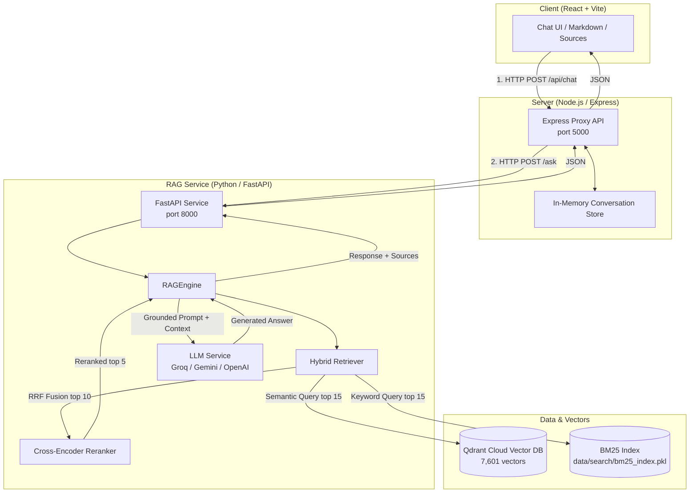

# Striver DSA AI Mentor — System Architecture & Design

This document details the architecture, design choices, data flow, and technical implementation of the **Striver DSA AI Mentor** RAG system.

---

## 1. System Overview

The system ingests, transcribes, chunks, embeds, indexes, and queries **316 YouTube videos** from Striver's A2Z DSA playlist. It exposes an interactive AI Mentor with hybrid retrieval, cross-encoder reranking, grounded LLM responses, and YouTube timestamp citations across 5 mentorship modes.

---

## 2. Pipeline Components

### 2.1 Audio Download & Transcription (`audio_downloader.py` & `transcriber.py`)
- **Audio Extraction**: `yt-dlp` extracts `m4a` audio format from YouTube playlist links.
- **Authentication**: Supports browser cookie extraction (`chrome`, `edge`, `firefox`, etc.) or custom `cookies.txt` to bypass YouTube bot detection/login checks.
- **Speech-to-Text**: `Faster-Whisper` (`base` model) with lazy single-instance initialization.
- **Hardware Acceleration & Fallback**:
  - Primary: `CUDA` / `float16` using official `nvidia-cublas-cu12` runtime binaries.
  - Fallback: Automatic fallback to `CPU` / `int8` if CUDA initialization or first-compute execution fails.

### 2.2 Time-Aware Chunking (`chunker.py`)
- **Strategy**: Fixed time duration chunking (75 seconds per chunk) with a 15-second overlap.
- **Context Preservation**: Groups transcript segments by timestamp ranges instead of arbitrary character or word counts, guaranteeing that video start (`start_sec`) and end (`end_sec`) timestamps directly correspond to real lecture intervals for precise YouTube link generation.

### 2.3 Vector Embedding & Storage (`embedder.py` & `vector_store.py`)
- **Embedding Model**: `sentence-transformers/all-MiniLM-L6-v2` (384-dimensional dense vectors).
- **Vector Database**: Managed Qdrant Cloud collection (`striver_dsa_chunks`).
- **Data Volume**: 316 videos yielding **7,601 vector points**.
- **Deterministic Point IDs**: UUIDv5 generated from video ID and chunk index for idempotent upserts.

### 2.4 Hybrid Retrieval & Reranking (`retrieval/`)
- **Semantic Search**: Queries Qdrant Cloud vector store for top 15 candidate chunks.
- **BM25 Keyword Search**: Evaluates query terms against the 14.49 MB pre-built BM25 index for top 15 candidate chunks.
- **Reciprocal Rank Fusion (RRF)**: Merges semantic and keyword candidates with smoothing parameter $k = 60$.
- **Cross-Encoder Reranking**: Re-scores top 10 fused candidates using `cross-encoder/ms-marco-MiniLM-L-6-v2` to produce final top 5 context chunks.
- **Grounding Threshold**: Enforces `YTRAG_MIN_SCORE = 0.25` cosine similarity floor. Chunks scoring below this threshold are rejected to prevent hallucinated answers.

### 2.5 Multi-Mode Mentorship & LLM Generation (`rag_engine.py`)
- **Supported Providers**: Groq (`openai/gpt-oss-20b`, `llama-3.3-70b-versatile`), Google Gemini, OpenAI.
- **5 Custom System Prompt Modes**: Explain, Hint, Approach, Code Review, Quiz.

---

## 3. Technology Stack

| Component | Technology | Purpose |
|---|---|---|
| **Transcription** | Faster-Whisper (CUDA float16 / CPU int8) | Fast lecture audio transcription |
| **Embeddings** | Sentence-Transformers (`all-MiniLM-L6-v2`) | 384-dim dense embeddings |
| **Vector DB** | Qdrant Cloud | Cloud vector storage & search (7,601 vectors) |
| **Sparse Search** | rank-bm25 (In-memory / Pickle) | Exact term / keyword matching |
| **Reranker** | Sentence-Transformers Cross-Encoder | High-precision result re-ordering |
| **LLM Inference** | Groq / Gemini / OpenAI APIs | Grounded response generation |
| **RAG Service** | Python 3.11 + FastAPI + Uvicorn | High-performance Python backend |
| **Web Server** | Node.js + Express | API Gateway, state, CORS, proxy |
| **Frontend UI** | React 18 + Vite + Tailwind CSS | Responsive chat UI with source cards |

---

## 4. Technical Tradeoffs & Key Decisions

1. **Time-Aware Chunking vs. Token-Based Chunking**:
   - *Decision*: Fixed 75s duration with 15s overlap.
   - *Tradeoff*: Ensures exact start/end timestamp precision for YouTube deep links, even if text token counts slightly vary across chunks.

2. **Hybrid Search (Dense + BM25 + RRF) vs. Pure Vector Search**:
   - *Decision*: Combine Qdrant vector retrieval with BM25 keyword matching via RRF.
   - *Tradeoff*: Pure vector search missed specific DSA function names and syntax keywords (e.g. `lower_bound`, `unordered_map`, `Kadane`). BM25 ensures exact keyword recall, while dense search provides semantic understanding.

3. **Cross-Encoder Reranking**:
   - *Decision*: Add `ms-marco-MiniLM-L-6-v2` cross-encoder reranking step after RRF fusion.
   - *Tradeoff*: Introduces ~50-100ms latency during search, but significantly improves prompt precision by prioritizing context chunks with exact query relevance.

4. **Lazy Model Loading & CUDA Fallback**:
   - *Decision*: Single-instance lazy initialization of Whisper and Reranker models, with runtime CPU fallback.
   - *Tradeoff*: Avoids high startup overhead and memory lockup while ensuring high availability across systems with or without dedicated NVIDIA GPU hardware.

